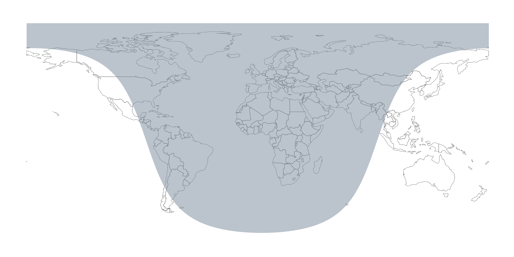

# terminator

Compute Global Terminator (Day/Night) Bands

## Description

Compute global terminator (day/night) bands which can be overlayed as day and night regions on a ggplot2 world map.

This is an Rcpp port of a [pure R port](https://github.com/JoGall/terminator) (by @JoGall) of a JS leaflet plugin.

## What's Inside The Tin

The following functions are implemented:

- `terminator`:	Compute a single termiantor band
- `terminator_lat_lon`:	Generate a full set of terminator frames

## Installation

```{r eval=FALSE}
devtools::install_github("hrbrmstr/terminator")
```

```{r message=FALSE, warning=FALSE, error=FALSE, include=FALSE}
options(width=120)
```

## Usage

(NOTE: If you're trying to just knit this Rmd, remove the `eval=FALSE` bits. I didn't want to keep generating things and was too impatient to wait for a `cache=TRUE` run).

```{r message=FALSE, warning=FALSE, error=FALSE}
library(terminator)
library(ggplot2)
library(gganimate) # devtools::install_github("dgrtwo/gganimate")

# current verison
packageVersion("terminator")
```

Joe had an asesome idea and made a perfectly fine pure R port. This one is just a wee bit faster.

```{r bench, eval=FALSE}
microbenchmark::microbenchmark(
  pure_r = pure_r_terminator(as.POSIXct(Sys.Date()) + (60*60*0), -180, 190, 0.5),
  rcpp = terminator::terminator(as.POSIXct(Sys.Date()) + (60*60*0), -180, 190, 0.5),
  times=100
) -> mb

mb
## Unit: microseconds
##    expr        min          lq        mean      median         uq        max neval
##  pure_r 142373.445 157488.8415 174413.4417 173927.7860 184725.916 272773.959   100
##    rcpp    483.505    553.2455    641.8395    609.8245    692.899   2487.993   100
```

Rather than use the built-in map data, we'll use an `rnaturalearth` so we don't need to mess with extended longitudes.

```{r wintri, fig.width=10}
library(ggalt)
library(rnaturalearth) # ropensci/rnaturalearth

world_map <- fortify(countries110)

ggplot() +
  geom_cartogram(
    data=world_map, map=world_map, aes(x=long, y=lat, map_id=id),
    fill=NA, color="#2b2b2b"
  ) -> gg

for (i in 0:23) {
  
  gg <- gg + geom_line(
    data=terminator(as.integer((as.POSIXct(Sys.Date()) + (60*60*i))), -180, 180, 0.1),
    aes(lon, lat), color="blue"
  )
}

gg + coord_proj("+proj=wintri") + ggthemes::theme_map()
```

Animation with `magick`:

```{r magick, eval=FALSE}
library(magick)
library(rnaturalearth) # ropensci/rnaturalearth
library(tidyverse)

world_map <- fortify(countries110, region="name")
world_map <- filter(world_map, id != "Antarctica")

x <- image_graph(width=1000*2, height=500*2, res=144)
pb <- progress_estimated(24)
for (i in 0:23) {
  pb$tick()$print()
  ggplot() +
    geom_cartogram(
      data=world_map, map=world_map, aes(x=long, y=lat, map_id=id),
      fill=NA, color="#2b2b2b", size=0.125
    ) +
    geom_ribbon( 
      data=terminator(as.integer((as.POSIXct(Sys.Date()) + (60*60*(i)))), -180, 180, 0.1),
      aes(lon, ymin=lat, ymax=90), fill="lightslategray", alpha=1/2
    ) +
    scale_x_continuous(limits=c(-180, 180)) +
    coord_quickmap() +
    ggthemes::theme_map() -> gg
  print(gg)
}
dev.off()
x <- image_animate(x)
image_write(x, "magick-preview.gif")
```



Using Joe's animation example:

```{r anim, eval=FALSE}
term_seq <- terminator_lat_lon()

chart <- ggplot(term_seq, aes(frame = frame)) +
  borders("world", colour = "gray90", fill = "gray85") +
  geom_ribbon(aes(lon, ymax = lat), ymin = 90, alpha = 0.2) +
  coord_equal(xlim = c(-180, 190), ylim = c(-58, 85), expand = 0) +
  ggthemes::theme_map()

gganimate(
  chart, 
  interval = 0.1, ani.width=1000, ani.height=600, 
  filename = "terminator-animation.gif"
)
```


